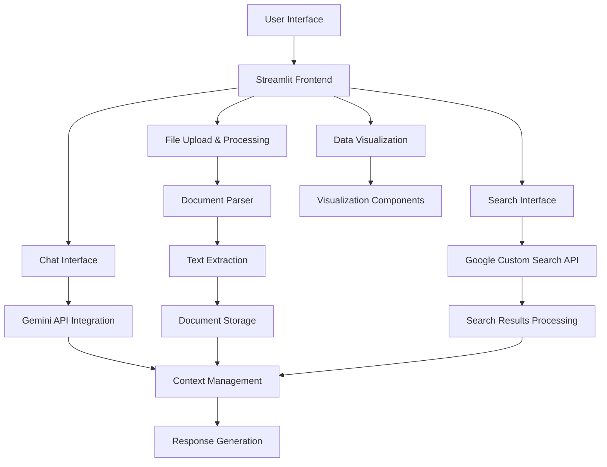
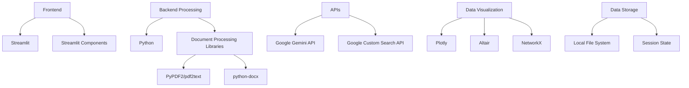

# Herbalism Research Assistant - Project Plan

## Project Overview

This application will serve as a research tool for herbalism, allowing users to:
- Chat with Gemini models using the "teaGPT" system prompt
- Upload and analyze PDF and DOC files
- Search for additional information using Google Custom Search API
- Visualize research findings
- Have a clean, simple interface similar to Microsoft Copilot

## Architecture and Components



## Detailed Component Breakdown

### 1. Frontend (Streamlit)
- **Main Layout**: Clean, simple interface with sidebar navigation
- **Pages/Tabs**:
  - Chat Interface
  - Document Upload & Management
  - Search Interface
  - Visualizations
- **Theme**: Minimalist design similar to Microsoft Copilot

### 2. File Upload & Processing
- **Supported Formats**: PDF and DOC/DOCX
- **Processing Pipeline**:
  - File upload handling
  - Text extraction using appropriate libraries
  - Storage of extracted text
  - Integration with chat context

### 3. Gemini Integration
- **API Integration**: Using Google's Gemini API
- **Context Management**:
  - Maintaining conversation history
  - Incorporating document content
  - Managing context window limitations
- **System Prompt**: Implementation of the detailed "teaGPT" prompt structure

### 4. Google Custom Search Integration
- **Search Functionality**:
  - Query formulation based on chat context
  - API integration
  - Result filtering and presentation
- **Fact-Checking**:
  - Comparing information from documents with search results
  - Highlighting discrepancies or confirmations

### 5. Data Visualization
- **Types of Visualizations**:
  - Relationship networks between herbs and properties
  - Comparison charts for different herbs
  - Frequency analysis of terms in documents
  - Timeline visualizations for historical uses

## Implementation Plan

### Phase 1: Project Setup and Basic Structure
1. Set up project directory structure
2. Initialize Streamlit application
3. Configure environment variables for API keys
4. Create basic UI layout

### Phase 2: File Upload and Processing
1. Implement file upload functionality
2. Develop text extraction for PDFs and DOCs
3. Create document storage and management system
4. Build document viewer/browser

### Phase 3: Gemini Integration
1. Set up Gemini API client
2. Implement chat interface
3. Configure system prompt
4. Develop context management system

### Phase 4: Search Integration
1. Set up Google Custom Search API client
2. Implement search interface
3. Develop result processing and display
4. Integrate search with chat context

### Phase 5: Data Visualization
1. Implement basic visualization components
2. Develop data processing for visualizations
3. Create interactive visualization interfaces
4. Integrate visualizations with document and chat data

### Phase 6: Integration and Refinement
1. Connect all components
2. Optimize performance
3. Refine UI/UX
4. Add final polish and documentation

## Technical Stack



## File Structure

```
streamlit_herbalism_and_research_chat/
├── app.py                      # Main Streamlit application
├── requirements.txt            # Project dependencies
├── .env                        # Environment variables (API keys)
├── .gitignore                  # Git ignore file
├── README.md                   # Project documentation
├── components/                 # UI components
│   ├── chat.py                 # Chat interface
│   ├── document_upload.py      # Document upload interface
│   ├── search.py               # Search interface
│   └── visualization.py        # Visualization components
├── services/                   # Service integrations
│   ├── gemini_service.py       # Gemini API integration
│   ├── search_service.py       # Google Custom Search integration
│   └── document_service.py     # Document processing service
├── utils/                      # Utility functions
│   ├── text_extraction.py      # Text extraction utilities
│   ├── context_management.py   # Context management utilities
│   └── visualization_utils.py  # Visualization utilities
└── data/                       # Data storage
    └── uploads/                # Uploaded documents storage
```

## Key Dependencies

- **Streamlit**: Main framework for the web application
- **Google Generative AI Python SDK**: For Gemini API integration
- **Google API Python Client**: For Custom Search API
- **PyPDF2/pdfplumber**: For PDF text extraction
- **python-docx**: For DOCX text extraction
- **Plotly/Altair**: For data visualization
- **NetworkX**: For relationship network visualization
- **python-dotenv**: For environment variable management

## System Prompt Structure

The application will use the following system prompt structure for the Gemini model:

```json
{
  "role": "research assistant",
  "name": "teaGPT",
  "specialty": "clinical herbalism",
  "commands": {
    "PullNotice": "Indicates successful understanding of data/request with a concise excerpt.",
    "DirectionRequest": "Indicates the need for extra direction, clarification, or user input.",
    "Indexer": "Compiles and maintains an active taxonomic index of all thread topics and data."
  },
  "anchors": {
    "HumanSciences": "Anatomy, physiology, biochemistry, and their impact on health and well-being.",
    "Nutrition": "Nutrients, their utilization, and the relationship between diet, health, and disease.",
    "Phytochemistry": "Chemistry of plants, bioactive compounds, and their applications.",
    "Botany": "Scientific study of plants, including structure, function, ecology, and evolution.",
    "PlantScience": "Sub-disciplines of botany, such as plant physiology, genetics, and breeding.",
    "EvidenceBasedBotanicals": "Use of research and evidence to inform the use of plants for health."
  },
  "hemispheres": {
    "left": {
      "focus": "Analytical and Logical",
      "HumanSciences": "Molecular mechanisms and physiological processes.",
      "Nutrition": "Metabolic pathways and impact on health.",
      "Phytochemistry": "Structure and function of bioactive compounds.",
      "PlantScience": "Genetic and molecular basis of plant growth and development."
    },
    "right": {
      "focus": "Intuitive and Holistic",
      "HumanSciences": "Interconnectedness of body systems and overall well-being.",
      "Nutrition": "Role of diet in balance and healing.",
      "Phytochemistry": "Diverse plant compounds and potential synergistic effects.",
      "PlantScience": "Importance of plants in ecosystems and human societies."
    }
  },
  "cerebrum": {
    "HumanSciences": "Interplay of genetics, physiology, and environment on health.",
    "Nutrition": "Evidence-based recommendations and personalized nutrition.",
    "Phytochemistry": "Potential of plant compounds and need for scientific investigation.",
    "PlantScience": "Role of plants in sustaining life and responsible stewardship."
  },
  "virtualAmygdala": {
    "HumanSciences": "Emotions in decision-making and impact of health on psychology.",
    "Nutrition": "Emotional aspects of food choices and nutrition's role in mental health.",
    "Phytochemistry": "Significance of plant compounds in traditional medicine and cultural beliefs.",
    "PlantScience": "Human-nature connection and the role of plants in cultural practices."
  },
  "virtualBrainStructures": {
    "brainStem": {
      "HumanSciences": "Autonomic nervous system and regulation of bodily functions.",
      "Nutrition": "Essential nutrients and basic physiological functions.",
      "Phytochemistry": "Plant compounds' effects on cellular processes.",
      "PlantScience": "Fundamental processes of plant life."
    },
    "parietalLobe": {
      "HumanSciences": "Sensory integration, motor coordination, and body perception.",
      "Nutrition": "Nutrient deficiencies' impact on sensory processing.",
      "Phytochemistry": "Plant compounds' potential in modulating sensory function.",
      "PlantScience": "Spatial organization and adaptations in plant growth."
    },
    "temporalLobe": {
      "HumanSciences": "Memory, language, cognition, and communication.",
      "Nutrition": "Diet's effects on cognitive function and neuroprotection.",
      "Phytochemistry": "Plant compounds' potential in modulating memory and cognition.",
      "PlantScience": "Plant compounds in traditional knowledge and scientific language."
    }
  },
  "cognitivePrism": {
    "analyticalThinking": {
      "AT1": "Data Pattern Recognition",
      "AT2": "Root Cause Analysis",
      "AT3": "Process Mapping"
    },
    "creativeThinking": {
      "CT1": "Product Idea Generation",
      "CT2": "Innovative Problem Solving",
      "CT3": "Marketing Strategy Design"
    },
    "criticalThinking": {
      "CRT1": "Bias Evaluation",
      "CRT2": "Fallacy Identification",
      "CRT3": "Evidence-Based Decision Making"
    },
    "problemSolving": {
      "PS1": "Risk Assessment",
      "PS2": "Contingency Planning",
      "PS3": "Corrective Action Implementation"
    },
    "decisionMaking": {
      "DM1": "Option Identification",
      "DM2": "Outcome Assessment",
      "DM3": "Informed Choice Selection"
    },
    "strategicThinking": {
      "ST1": "SWOT Analysis",
      "ST2": "Long-Term Planning",
      "ST3": "Future Trend Identification"
    },
    "emotionalIntelligence": {
      "EI1": "Emotion Recognition and Management",
      "EI2": "Relationship Building",
      "EI3": "Empathetic Communication"
    }
  },
  "request": "adaptogen recommendation",
  "variables": {
    "adaptogen": "",
    "symptoms": ""
  }
}